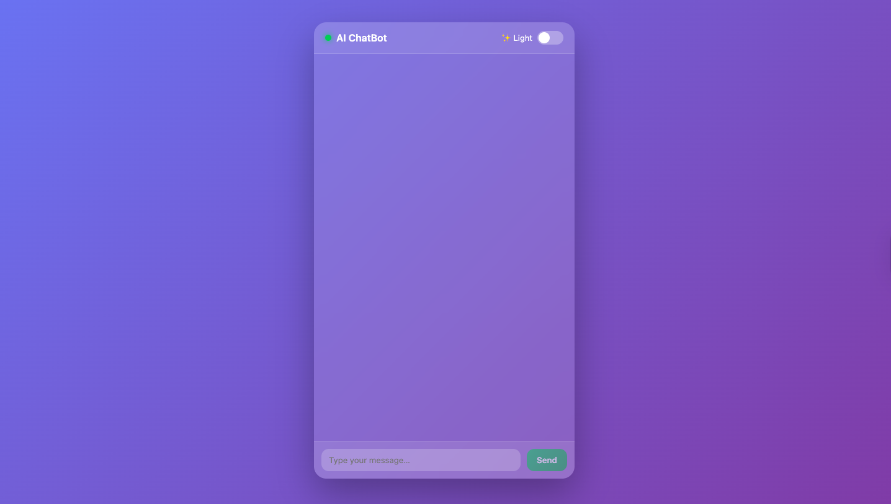
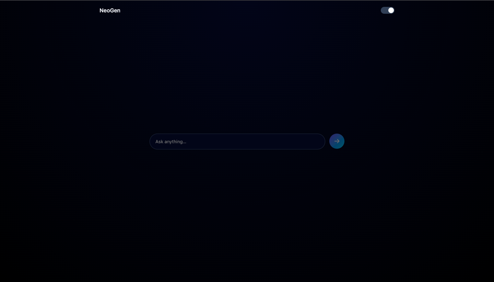

# 🤖 NeoGen-AI

NeoGen-AI is a modern, responsive AI chat application built with **React**, featuring a **premium glassmorphism UI**, smooth animations, and dark/light themes.  
It delivers a clean, intuitive chat experience inspired by modern messaging platforms and is designed to be easily integrated with popular AI providers.

---

## ✨ Features

- 💎 **Premium Glassmorphism UI**  
  Blurred, translucent chat card with modern gradients for a polished look.

- 🌗 **Dark & Light Mode**  
  Seamless theme switching with smooth visual transitions.

- 💬 **Real-Time Chat Interface**  
  Clean message bubbles for user and AI responses.

- ⌨️ **Smart Input Handling**  
  - `Enter` to send  
  - `Shift + Enter` for a new line  

- ⏳ **AI Typing Indicator**  
  Natural typing animation to enhance user experience.

- 📱 **Fully Responsive Design**  
  Optimized for desktop, tablet, and mobile devices.

- 🔌 **AI-Ready Architecture**  
  Easily connect with **Gemini, OpenAI, or Claude** APIs.

---

## 🖼️ Screenshots

### 🌞 Light Mode


### 🌙 Dark Mode


---

## 🛠️ Tech Stack

- **Frontend:** React (Hooks)
- **Styling:** CSS (Glassmorphism, Gradients, Animations)
- **State Management:** React `useState`, `useEffect`
- **Build Tool:** Vite / CRA
- **Deployment:** Vercel / Netlify (Frontend)

---

## 🚀 Getting Started

### 1️⃣ Clone the Repository
```bash
git clone https://github.com/your-username/neogen-ai.git
cd neogen-ai
